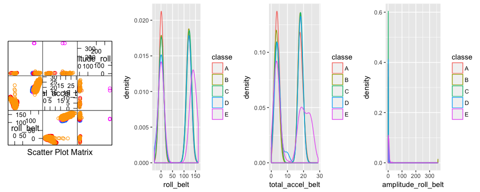
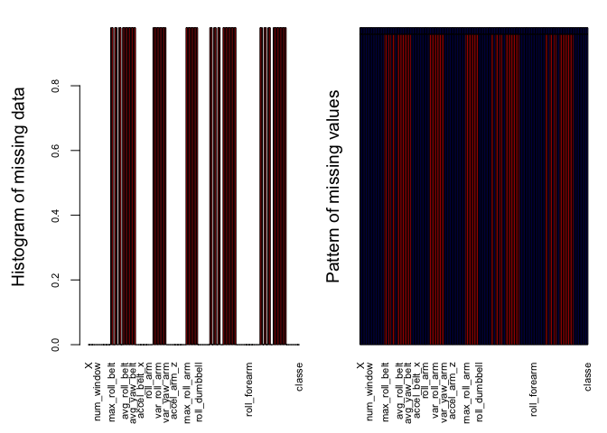

## Overview

Massive amount of data is being generated by modern gadgets that record activities
performed by people in daily life. Data from wearable tech gadgets mostly shows how long the activity has been performed, but rarely has this data been used to determine the quality of the activity being performed. For this analysis, we used the Weight Lifting Exercise Dataset from http://web.archive.org/web/20161224072740/http:/groupware.les.inf.puc-rio.br/har to build a model to predict the quality of the activities by classifying them into five different classes A to E. This task was performed in 5 steps. 

## Step 1: Loading the datasets
The training and testing datasets were loaded using read.csv()


```r
#Reading training and testing data sets
train_dat = read.csv("~/Desktop/pml-training.csv")
test_dat = read.csv("~/Desktop/pml-testing.csv")

str(train_dat[1:10])
```

```
## 'data.frame':	19622 obs. of  10 variables:
##  $ X                   : int  1 2 3 4 5 6 7 8 9 10 ...
##  $ user_name           : Factor w/ 6 levels "adelmo","carlitos",..: 2 2 2 2 2 2 2 2 2 2 ...
##  $ raw_timestamp_part_1: int  1323084231 1323084231 1323084231 1323084232 1323084232 1323084232 1323084232 1323084232 1323084232 1323084232 ...
##  $ raw_timestamp_part_2: int  788290 808298 820366 120339 196328 304277 368296 440390 484323 484434 ...
##  $ cvtd_timestamp      : Factor w/ 20 levels "02/12/2011 13:32",..: 9 9 9 9 9 9 9 9 9 9 ...
##  $ new_window          : Factor w/ 2 levels "no","yes": 1 1 1 1 1 1 1 1 1 1 ...
##  $ num_window          : int  11 11 11 12 12 12 12 12 12 12 ...
##  $ roll_belt           : num  1.41 1.41 1.42 1.48 1.48 1.45 1.42 1.42 1.43 1.45 ...
##  $ pitch_belt          : num  8.07 8.07 8.07 8.05 8.07 8.06 8.09 8.13 8.16 8.17 ...
##  $ yaw_belt            : num  -94.4 -94.4 -94.4 -94.4 -94.4 -94.4 -94.4 -94.4 -94.4 -94.4 ...
```

```r
dim(train_dat)
```

```
## [1] 19622   160
```

```r
dim(test_dat)
```

```
## [1]  20 160
```

## Step 2: Exploring and Cleaning the datasets

### Plotting predictors
To get an idea about the data, we made pairwise feature plots with some variables. We see that most of the points for different classes overlapped for the variables however the points for class E sometimes do not. 
To investigate further we made density plots for these variables. The density plots showed that class A and B have similar density curves but class E has very different distribution compared to the other classes and also that some variables like "amplitude_roll_belt" have a lot of missing values. 


```r
suppressMessages(library(caret))
suppressMessages(library(ggplot2))
suppressMessages(library(gridExtra))
p1 <- featurePlot(x = train_dat[,c("roll_belt","total_accel_belt","amplitude_roll_belt")],y=train_dat$classe,plot = "pairs")
p2 <- qplot(roll_belt,colour=classe,data=train_dat,geom="density")
p3 <- qplot(total_accel_belt ,colour=classe,data=train_dat,geom="density")
p4 <- qplot(amplitude_roll_belt,,colour=classe,data=train_dat,geom="density")
#Putting the plots in one figure
grid.arrange(p1,p2,p3,p4,nrow=1)
```

```
## Warning: Removed 19216 rows containing non-finite values (stat_density).
```

<!-- -->


### Identifying and handling variables with Missing Values

Missing data can cause the prediction algorithm to fail and therefore we looked for
NA/missing values in the dataset. We looked at the distribution of the NA values in order to determine the best method for dealing with them.

a) Number of rows with missing data in the training dataset were calculated and
percentage was computed using completeCases(). A large number of rows were found to
have missing values. 

b) Next we used the aggregate() function from VIM package to plot a histogram of the missing values and to look at the pattern of missing values for each variable of the training dataset. This showed that certain variables(columns) had over 90% of their values missing  and the rest had no missing values. Therefore, it did not make sense to impute values, and these variables once identified could be safely dropped.

c) We identified variables with 90% or more missing values and added them to a list for removal.
Also, we added the first 7 variables of the dataset which were not suitable/required for 
model creation to the list for removal. 

d) In total we dropped 73 variables from the training and test data set by this process.


```r
## a) Missing data in training set
nrows <- nrow(train_dat)
ncomplete <- sum(complete.cases(train_dat))
ncomplete
```

```
## [1] 406
```

```r
ncomplete/nrows
```

```
## [1] 0.02069106
```

```r
## b) Plotting histogram of missing data using VIM package
# Aggregate plot to show pattern and frquency of missing data
suppressMessages(library(VIM))
aggr_plot <- aggr(train_dat, col=c('navyblue','red'), numbers=FALSE, 
             combined = FALSE, sortVars=FALSE, varheight = TRUE, labels=names(train_dat),
             cex.axis=.7, gap=3, ylab=c("Histogram of missing data","Pattern of missing values"))
```

<!-- -->


```r
# c) Calcualting percentage of missing values for each variable of the trianing set 
pMiss <- function(x){sum(is.na(x))/length(x)*100}
apply(train_dat,2,pMiss)
```


```r
# d) Removing columns with more than 97% missing values (determined from above) and first 6 variables of the training dataset and matching col from test data set

to_remove <- c("X","user_name","raw_timestamp_part_1","raw_timestamp_part_2","cvtd_timestamp",           "num_window","max_roll_belt","max_picth_belt","min_roll_belt","min_pitch_belt",
        "amplitude_roll_belt","amplitude_pitch_belt","var_total_accel_belt","avg_roll_belt","stddev_roll_belt",
        "var_roll_belt","avg_pitch_belt","stddev_pitch_belt","var_pitch_belt","avg_yaw_belt","stddev_yaw_belt","var_yaw_belt",
        "var_accel_arm","avg_roll_arm","stddev_roll_arm","var_roll_arm","avg_pitch_arm","stddev_pitch_arm","var_pitch_arm", 
        "avg_yaw_arm","stddev_yaw_arm","var_yaw_arm","max_roll_arm","max_picth_arm","max_yaw_arm",             
        "min_roll_arm","min_pitch_arm","min_yaw_arm","amplitude_roll_arm","amplitude_pitch_arm",
        "amplitude_yaw_arm","max_roll_dumbbell","max_picth_dumbbell","min_roll_dumbbell",
        "min_pitch_dumbbell","amplitude_roll_dumbbell","amplitude_pitch_dumbbell",
        "var_accel_dumbbell","avg_roll_dumbbell","stddev_roll_dumbbell","var_roll_dumbbell",
        "avg_pitch_dumbbell","stddev_pitch_dumbbell","var_pitch_dumbbell","avg_yaw_dumbbell",
        "stddev_yaw_dumbbell","var_yaw_dumbbell","max_roll_forearm","max_picth_forearm",
        "min_roll_forearm","min_pitch_forearm","amplitude_roll_forearm","amplitude_pitch_forearm",
        "var_accel_forearm","avg_roll_forearm","stddev_roll_forearm","var_roll_forearm",
        "avg_pitch_forearm","stddev_pitch_forearm","var_pitch_forearm","avg_yaw_forearm",
        "stddev_yaw_forearm","var_yaw_forearm")

my_train <- train_dat[,-which(names(train_dat) %in% to_remove)]
dim(my_train)

my_test <- test_dat[,-which(names(test_dat) %in% to_remove)]
dim(my_test)
```

### Identifying and Handling covariates with Near Zero Variance

Variables with near zero variance are not useful for creating a good model.
Therefore, we identified variables with no variance with the
nearZeroVars() from caret. Variables names which did not have near zero variance 
were selected and the ones with near zero variance were dropped from the final training
dataset. Matching variables were also dropped from the final testing dataset

The final train_dataset with 53 variables was then used to build our model.


```r
suppressMessages(library("caret"))
nzv <- nearZeroVar(my_train, saveMetrics= TRUE)
nzv

suppressMessages(library(tibble))
suppressMessages(library(dplyr))
##Converting nzv into a tibble and preserving the row names using tibble package
nzv_tbl = as_tibble(rownames_to_column(nzv))
##Selecting row names for rows where nzv is FALSE
nzv_rows <- filter(nzv_tbl, nzv == FALSE)

##Selecting columns from my_train where nzv rows values were FALSE
new_train <- my_train[, nzv_rows$rowname]
new_test <- my_test[, nzv_rows$rowname[1:52]]
new_test$problem_id <- my_test$problem_id

sum(is.na(new_train))
sum(is.na(new_test))
```


## Step 3: Converting all the qualitative variables

All factor variables in the training set, except the outcome "classe"" variable, were converted to indicator variables using the dummyVars() from caret to prepare the dataset for building the machine learning algorithm.


```r
##Convert qualitative variables to quantitative or dummy variables
dmy <- dummyVars(" ~ .", data = new_train[,-53],fullRank = T)
new_train_transformed <- data.frame(predict(dmy, newdata = new_train))
new_train_transformed$classe <- new_train$classe
```

## Step 4: Building the machine learning algorithm on the tidy dataset.

The outcome variable is categorical and we have a classification problem. We decided to build our model with "gbm", a stochastic boosting algorithm.  

We set the seed and fit a boosted tree model with "gbm", 2 fold cross-validation with 3 repeats
as the resampling method. This model gave maximum accuracy of 0.9606904 and was used to 
successfully predict all 20 cases of the prediction quiz.

In order to improve accuracy, parallel processing was setup and the above algorithm was used to do a 
5 fold cross-validation with 3 repeats.
This only slighty improved the accuracy value to 0.9628140. Parallel processing 
made it possible to accomplish this task without stalling.


```r
suppressMessages(library(parallel))
suppressMessages(library(doParallel))
suppressMessages(library("gbm"))

#Configuring paralell processing
cluster <- makeCluster(detectCores() - 1) # leaving 1 core for OS
registerDoParallel(cluster)

# 2. Setting the seed
set.seed(1234)

# Configuring trainControl
fitControl1 <- trainControl(## 5-fold CV
    method = "repeatedcv",
    number = 5,
    ## repeated ten times
    repeats = 3,allowParallel = TRUE)# fold cv repeated 3 times

# Fitting the model
gbmFit <- train(classe ~ ., data = new_train_transformed, 
                 method = "gbm", 
                 trControl = fitControl1, #from above to load train control parameters
                 verbose = FALSE)

# Trurning off the paralell processing 
stopCluster(cluster)
registerDoSEQ()

# Looking at the fit
gbmFit
```

```
## Stochastic Gradient Boosting 
## 
## 19622 samples
##    52 predictor
##     5 classes: 'A', 'B', 'C', 'D', 'E' 
## 
## No pre-processing
## Resampling: Cross-Validated (5 fold, repeated 3 times) 
## Summary of sample sizes: 15697, 15698, 15697, 15698, 15698, 15699, ... 
## Resampling results across tuning parameters:
## 
##   interaction.depth  n.trees  Accuracy   Kappa    
##   1                   50      0.7545615  0.6888350
##   1                  100      0.8213399  0.7738689
##   1                  150      0.8536165  0.8147544
##   2                   50      0.8554509  0.8168570
##   2                  100      0.9077398  0.8832514
##   2                  150      0.9330176  0.9152416
##   3                   50      0.8971901  0.8698690
##   3                  100      0.9426324  0.9274182
##   3                  150      0.9628140  0.9529571
## 
## Tuning parameter 'shrinkage' was held constant at a value of 0.1
## 
## Tuning parameter 'n.minobsinnode' was held constant at a value of 10
## Accuracy was used to select the optimal model using the largest value.
## The final values used for the model were n.trees = 150,
##  interaction.depth = 3, shrinkage = 0.1 and n.minobsinnode = 10.
```

```r
# Using model to answer Prediction Quiz 
############################################
my_pred <- predict(gbmFit,newdata = new_test)
# Predictions for prediction Quiz
my_pred
```

```
##  [1] B A B A A E D B A A B C B A E E A B B B
## Levels: A B C D E
```

## Step 5: Building the final model using random forest with parallel processing

In the quest to improve accuracy and achieving a better fit we made a final attempt to implement the random forest algorithm using parallel processing. The caret package trainControl() was configured to do 5 fold cross-validation using random forest and the model was then evaluated to determine the accuracy. 
 

```r
suppressMessages(library(parallel))
suppressMessages(library(doParallel))
suppressMessages(library(randomForest))


# Training dataset without the outcome column
train_trans <- new_train_transformed[,-53]
# The outcome variable
test_trans <- new_train_transformed[,53]

# Configuring paralell processing
suppressMessages(library(doParallel))
cluster <- makeCluster(detectCores() - 1) # convention to leave 1 core for OS
registerDoParallel(cluster)

# Setting the seed
set.seed(1234)

# Configuring trainControl
fitControl <- trainControl(method = "cv",number = 5, allowParallel = TRUE)

# Fitting the final model using train()
fit <- train(train_trans,test_trans, method="rf",data=new_train_transformed,trControl = fitControl)

# Trurning off the paralell processing 
stopCluster(cluster)
registerDoSEQ()

# Looking at the fit
fit
```

```
## Random Forest 
## 
## 19622 samples
##    52 predictor
##     5 classes: 'A', 'B', 'C', 'D', 'E' 
## 
## No pre-processing
## Resampling: Cross-Validated (5 fold) 
## Summary of sample sizes: 15697, 15698, 15697, 15698, 15698 
## Resampling results across tuning parameters:
## 
##   mtry  Accuracy   Kappa    
##    2    0.9943430  0.9928438
##   27    0.9943940  0.9929084
##   52    0.9898582  0.9871700
## 
## Accuracy was used to select the optimal model using the largest value.
## The final value used for the model was mtry = 27.
```

```r
fit$resample
```

```
##    Accuracy     Kappa Resample
## 1 0.9949045 0.9935541    Fold1
## 2 0.9954140 0.9941992    Fold3
## 3 0.9923547 0.9903278    Fold2
## 4 0.9949032 0.9935527    Fold5
## 5 0.9943935 0.9929081    Fold4
```

```r
confusionMatrix.train(fit)
```

```
## Cross-Validated (5 fold) Confusion Matrix 
## 
## (entries are percentual average cell counts across resamples)
##  
##           Reference
## Prediction    A    B    C    D    E
##          A 28.4  0.1  0.0  0.0  0.0
##          B  0.0 19.2  0.1  0.0  0.0
##          C  0.0  0.0 17.3  0.2  0.0
##          D  0.0  0.0  0.0 16.2  0.1
##          E  0.0  0.0  0.0  0.0 18.3
##                             
##  Accuracy (average) : 0.9944
```

This model achieved an average accuracy of 99.4%, which was a big improvement over the value obtained by the previous model fit with "gbm". 

##Conclusion: 

* Exploring the data set and plotting the missing values showed us that some variables were missing more than 97% of their values whereas the others had no missing values. Therefore there was no reason to impute values and we identified these variables and removed them from the dataset.

* We also identified and removed values that had near zero variance which allowed for cleaning the dataset and prepared it for building our prediction algorithm.

* We fit a model using "gbm" algorithm first with 2 fold cross_validation repeated 3 time which resulted in accuracy of  0.9606904, then we fit the same algorithm with parallel processing with 5 fold cross validation with 3 repeats and got slightly improved accuracy of 0.9628140 at an interaction depth of 3 and n.trees=150. 

* Finally we fit a model using random forest with 5 fold cross validation and achieved very high accuracy results and low error rate. We chose this model as our final model and used it to predict the classes for all 20 cases of the prediction quiz successfully. 


```r
#Predicting classe of quiz test cases
fin_pred <- predict(fit,newdata = new_test)
fin_pred
```

```
##  [1] B A B A A E D B A A B C B A E E A B B B
## Levels: A B C D E
```

```r
# The fitted model
fit
```

```
## Random Forest 
## 
## 19622 samples
##    52 predictor
##     5 classes: 'A', 'B', 'C', 'D', 'E' 
## 
## No pre-processing
## Resampling: Cross-Validated (5 fold) 
## Summary of sample sizes: 15697, 15698, 15697, 15698, 15698 
## Resampling results across tuning parameters:
## 
##   mtry  Accuracy   Kappa    
##    2    0.9943430  0.9928438
##   27    0.9943940  0.9929084
##   52    0.9898582  0.9871700
## 
## Accuracy was used to select the optimal model using the largest value.
## The final value used for the model was mtry = 27.
```

```r
#Confusion matrix for final model
confusionMatrix(fit)
```

```
## Cross-Validated (5 fold) Confusion Matrix 
## 
## (entries are percentual average cell counts across resamples)
##  
##           Reference
## Prediction    A    B    C    D    E
##          A 28.4  0.1  0.0  0.0  0.0
##          B  0.0 19.2  0.1  0.0  0.0
##          C  0.0  0.0 17.3  0.2  0.0
##          D  0.0  0.0  0.0 16.2  0.1
##          E  0.0  0.0  0.0  0.0 18.3
##                             
##  Accuracy (average) : 0.9944
```

```r
#Final model of the fit
fit$finalModel
```

```
## 
## Call:
##  randomForest(x = x, y = y, mtry = param$mtry, data = ..1) 
##                Type of random forest: classification
##                      Number of trees: 500
## No. of variables tried at each split: 27
## 
##         OOB estimate of  error rate: 0.42%
## Confusion matrix:
##      A    B    C    D    E  class.error
## A 5575    2    2    0    1 0.0008960573
## B   18 3776    3    0    0 0.0055306821
## C    0    9 3403   10    0 0.0055523086
## D    0    0   25 3189    2 0.0083955224
## E    0    1    4    6 3596 0.0030496257
```

### Final Model: 

We chose the model built using random forest with 5 fold cross validation with the best accuracy values as our final model. This model was used to predict the classes for all 20 cases of the prediction quiz successfully.

We built a model that could be used to predict the quality of the activities performed with an accuracy of 99.6% and an error rate of 0.40%. Our model correctly predicted the class of the test cases and classified each test case into one of 5 classes A to E. Where A corresponds to the activity being performed correctly and all the other classes show activity with some mistakes.

Since random forest  accuracy values and confusionMatrix values are predicted against one fold which is held out, we used the finalModel object from the fit to get the out of sample error rate. We estimate that the error rate of 0.40% is representative of the expected out of sample error rate.

